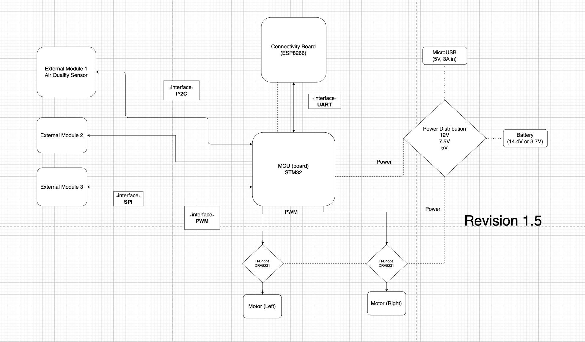

# Moduleo

### Introduction
In short, Moduleo is a robot. One that can do a handful of tasks, enabled by its modular design. It's based on a powertrain system with a dual motor driving scheme and a rechargeable Lithium-ion battery. The powertrain platform is be self-contained, with ports to mount different modules upon for flexible configurations. The first module being designed for it is a system of sensors to detect air quality and report it to a mobile app on a user’s device. Other modules may be designed, and need only implement a standard interface of communication to connect to the powertrain platform. The design is ongoing and will be subject to change as different components and technologies are weighed.

### Motivations
The motivations for designing and architecting this project stem from various factors. Firstly, my final embedded systems course, EECS 473, had a pesky requirement that all projects be “useful” and “marketable” rather than simply being fun to make. This project is more an exploration of the technologies in modern embedded systems, that incorporates all I learned in school as well as the analog hardware design I've learned during my tenure as an engineer -- in a fun package.

Secondly, it's my first solo project, building on my software and hardware knowledge while also serving as an exercise in design, manufacturing, and packaging with a bit of CAD and hands on crafting.

### Block Diagram

### Major Themes

I wanted to make a robot (originally inspired by Star Wars Droids)

- I gave myself specific constraints:
    - I needed to use my own designed PCB as the central hub of system.
    - I needed to use DriverLib or HAL software, minimize Arduino.
    - I needed to be network of boards, with UART/I2C connections between them.
    - I (eventually) want to incorporate an RTOS.

### Project History and Progress So Far

#### Picking the chassis

I found some spare parts as mechanical basis
- Right - old MakeBlock kit Tank Chassis
- Left - Tank Chassis from Amazon (for next version)

#### Picking the brains

I knew I needed 
- PWM output for 2-4 motors
- I2C drivers for future modules
- UART for connecting 2+ MCUs together
- GPIO for LED output, debug, etc.

STM32 was a mature platform with good peripherals and DriverLib, so I designed the first iteration around a STM32F Dev board.

#### Picking a communications platform

Wi-Fi chip was also needed for my preferred communication (Wi-Fi sockets)
This was a fairly straightforward choice in hobbyist world - Espressif has best drivers and can use Arduino IDE, so I designed around ESP8266 Dev board.

#### Picking the batteries

The main determinants for picking a battery are capacity and voltage levels.
I had two Lithium-ion batteries from other products laying around.
- Battery #1: a 14.4V rechargeable battery from Shark Robot Vacuum
- Battery #2: a 2.7V rechargeable battery from Amazon RC car

#### Motor Drivers

The tank Chassis both came with 12V brushed motors. This is pretty standard for brushed motors in small appliances since motor power correlates with size of its coils.
I had worked with Brushed motor drivers for a while, and had experience using the TI DRV8231
- This just needed 3.3V VREF and 12V VM

#### How to power it all?

Now we had 2 dev boards, 2 motors, and 2 potential battery voltages.
How do I make power tree to work with all the different parts?

- Used a boost and a buck-boost to receive VIN that could be 2-15V

- Used boost to power motors (wanted high voltage, low current)

- Used buck-boost to generate 7.5V rail, LDO to produce 3.3V for logic

